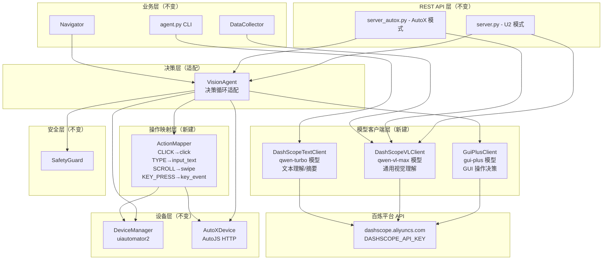

# 设计文档：GUI-Plus 集成（阿里云百炼平台 GUI 操作模型替换方案）

## 概述

本设计将 OpenClaw 手机自动化平台的视觉决策层从 GLM-4V/4.6V 替换为阿里云百炼平台的多模型协作架构。核心变更是引入三个新客户端模块（GuiPlusClient、DashScopeVLClient、DashScopeTextClient），一个操作映射模块（ActionMapper），以及对 VisionAgent 决策循环的适配。现有的 FastAPI 服务层、SafetyGuard、Navigator、DataCollector 等上层组件通过依赖注入保持兼容，无需修改自身逻辑。

### 设计原则

1. **最小侵入**：仅替换视觉/文本模型客户端层，上层业务逻辑不变
2. **依赖注入**：所有组件通过构造参数接收客户端实例，便于测试和替换
3. **职责分离**：GUI 操作决策（gui-plus）、通用视觉理解（qwen-vl-max）、文本理解（qwen-turbo）各司其职
4. **向后兼容**：REST API 端点路径和请求/响应格式完全不变

## 架构

### 整体架构图



### 模块变更清单

| 模块 | 变更类型 | 说明 |
|------|---------|------|
| `dashscope_client.py`（新建） | 新建 | GuiPlusClient、DashScopeVLClient、DashScopeTextClient |
| `action_mapper.py`（新建） | 新建 | GUI-Plus 操作类型到 DeviceManager 操作的映射 |
| `vision_agent.py` | 修改 | 适配 GuiPlusClient 的 decide 接口和 GUI-Plus 响应格式 |
| `server.py` | 修改 | 替换 GlmVisionClient 为新客户端，更新初始化逻辑 |
| `server_autox.py` | 修改 | 同上，并将内联 smart_task 逻辑替换为 VisionAgent |
| `agent.py` | 修改 | 替换 GLM 文本调用为 DashScopeTextClient |
| `collector.py` | 修改 | 构造参数类型从 GlmVisionClient 改为 DashScopeVLClient |
| `strategies/rpa_ocr_strategy.py` | 无需修改 | 通过依赖注入自动使用新的 vision_client |
| `vision.py` | 保留 | GlmVisionClient 保留作为备用，不删除 |

## 组件与接口

### 1. GuiPlusClient（GUI 操作决策客户端）

文件：`u2-server/dashscope_client.py`

```python
class GuiPlusClient:
    """GUI-Plus 模型客户端，专用于 GUI 操作决策。"""

    BASE_URL = "https://dashscope.aliyuncs.com/compatible-mode/v1"
    TIMEOUT = 120.0

    def __init__(
        self,
        api_key: str | None = None,
        model: str = "gui-plus",
        high_resolution: bool = True,
    ):
        self.api_key = api_key or os.environ.get("DASHSCOPE_API_KEY", "")
        self.model = model
        self.high_resolution = high_resolution

    async def decide(
        self,
        base64_image: str,
        task_prompt: str,
        history: list[dict] | None = None,
    ) -> dict:
        """
        发送截图和任务描述给 GUI-Plus，获取操作决策。

        Args:
            base64_image: base64 编码的截图（PNG/JPEG）
            task_prompt: 当前任务目标描述
            history: 之前的对话历史（多轮对话）

        Returns:
            {
                "success": bool,
                "thought": str,        # 模型思考过程
                "action": str,         # CLICK/TYPE/SCROLL/KEY_PRESS/FINISH/FAIL
                "parameters": dict,    # 操作参数（坐标已经过 smart_size 映射）
                "raw_response": str,   # 原始响应文本
                "error": str | None,
            }
        """
        ...

    def _build_messages(
        self,
        base64_image: str,
        task_prompt: str,
        history: list[dict] | None,
    ) -> list[dict]:
        """构建 OpenAI 兼容的消息列表，包含系统提示词、历史和当前截图。"""
        ...

    @staticmethod
    def smart_size(
        original_width: int,
        original_height: int,
        model_x: int,
        model_y: int,
        max_pixels: int = 1344,
    ) -> tuple[int, int]:
        """
        将 GUI-Plus 返回的坐标映射回原始屏幕分辨率。

        GUI-Plus 内部将图片最长边缩放到 max_pixels，等比缩放。
        此函数根据原始尺寸和缩放规则，反算出实际屏幕坐标。

        Args:
            original_width: 原始截图宽度
            original_height: 原始截图高度
            model_x: 模型返回的 x 坐标
            model_y: 模型返回的 y 坐标
            max_pixels: GUI-Plus 内部最长边像素数（默认 1344）

        Returns:
            (actual_x, actual_y) 映射后的实际屏幕坐标
        """
        ...
```

### 2. DashScopeVLClient（通用视觉理解客户端）

文件：`u2-server/dashscope_client.py`（同文件）

```python
class DashScopeVLClient:
    """通义千问 VL 模型客户端，用于通用屏幕内容分析。

    提供与 GlmVisionClient 相同的 analyze 接口，作为直接替换。
    """

    BASE_URL = "https://dashscope.aliyuncs.com/compatible-mode/v1"
    TIMEOUT = 120.0

    def __init__(
        self,
        api_key: str | None = None,
        model: str = "qwen-vl-max",
    ):
        self.api_key = api_key or os.environ.get("DASHSCOPE_API_KEY", "")
        self.model = model

    async def analyze(self, base64_image: str, prompt: str) -> dict:
        """
        与 GlmVisionClient.analyze 接口完全兼容。

        Returns:
            {"success": bool, "description": str, "model": str, "error"?: str}
        """
        ...
```

### 3. DashScopeTextClient（文本模型客户端）

文件：`u2-server/dashscope_client.py`（同文件）

```python
class DashScopeTextClient:
    """通义千问文本模型客户端，用于意图理解和结果摘要。"""

    BASE_URL = "https://dashscope.aliyuncs.com/compatible-mode/v1"
    TIMEOUT = 30.0

    def __init__(
        self,
        api_key: str | None = None,
        model: str = "qwen-turbo",
    ):
        self.api_key = api_key or os.environ.get("DASHSCOPE_API_KEY", "")
        self.model = model

    async def chat(self, messages: list[dict]) -> str:
        """
        发送对话消息，返回模型文本响应。

        Args:
            messages: OpenAI 格式的消息列表 [{"role": "...", "content": "..."}]

        Returns:
            模型响应文本字符串
        """
        ...
```

### 4. ActionMapper（操作类型映射）

文件：`u2-server/action_mapper.py`

```python
# GUI-Plus 按键名到 Android KeyEvent 代码的映射
KEY_MAP = {
    "enter": 66,
    "back": 4,
    "home": 3,
    "recents": 187,
    "volume_up": 24,
    "volume_down": 25,
    "power": 26,
    "delete": 67,
    "tab": 61,
    "space": 62,
    "escape": 111,
}

# 默认滑动距离（像素）和持续时间（秒）
SCROLL_DISTANCE = 600
SCROLL_DURATION = 0.5


class ActionMapper:
    """将 GUI-Plus 操作映射为 DeviceManager 兼容的操作字典。"""

    @staticmethod
    def map_action(
        action: str,
        parameters: dict,
    ) -> dict:
        """
        将 GUI-Plus 的 action + parameters 映射为 DeviceManager 操作字典。

        Args:
            action: GUI-Plus 操作类型（CLICK/TYPE/SCROLL/KEY_PRESS/FINISH/FAIL）
            parameters: GUI-Plus 操作参数

        Returns:
            DeviceManager 兼容的操作字典，如：
            - {"type": "tap", "x": 540, "y": 960}
            - {"type": "input_text", "text": "hello"}
            - {"type": "swipe", "x1": 540, "y1": 1200, "x2": 540, "y2": 600, "duration": 500}
            - {"type": "key_event", "keyCode": 4}

        Raises:
            ValueError: 未知的 action 类型或缺少必要参数
        """
        ...
```

映射规则：

| GUI-Plus Action | Parameters | DeviceManager 操作 |
|----------------|------------|-------------------|
| CLICK | `{x, y}` | `{"type": "tap", "x": x, "y": y}` |
| TYPE | `{text}` | `{"type": "input_text", "text": text}` |
| SCROLL | `{x, y, direction}` | `{"type": "swipe", x1, y1, x2, y2, duration}` — 根据 direction 计算 |
| KEY_PRESS | `{key}` | `{"type": "key_event", "keyCode": KEY_MAP[key]}` |
| FINISH | — | `None`（任务完成信号） |
| FAIL | — | `None`（任务失败信号） |

SCROLL 方向映射逻辑：
- `up`: 从 (x, y) 向上滑动 SCROLL_DISTANCE 像素 → swipe(x, y, x, y - SCROLL_DISTANCE)
- `down`: 从 (x, y) 向下滑动 → swipe(x, y, x, y + SCROLL_DISTANCE)
- `left`: 从 (x, y) 向左滑动 → swipe(x, y, x - SCROLL_DISTANCE, y)
- `right`: 从 (x, y) 向右滑动 → swipe(x, y, x + SCROLL_DISTANCE, y)

### 5. VisionAgent 适配

文件：`u2-server/vision_agent.py`

主要变更：

1. 构造参数 `vision_client` 类型从 `GlmVisionClient` 改为 `GuiPlusClient`
2. `decide_next_action` 方法改为调用 `GuiPlusClient.decide()` 而非 `GlmVisionClient.analyze()`
3. 新增 `_parse_gui_plus_response` 方法解析 GUI-Plus 的 thought/action/parameters 格式
4. `_execute_action` 方法通过 `ActionMapper.map_action()` 将 GUI-Plus 操作转换为 DeviceManager 操作
5. 移除现有的 `SYSTEM_PROMPT` 常量（GUI-Plus 有自己的系统提示词，由 GuiPlusClient 管理）
6. SafetyGuard 检查使用 ActionMapper 映射后的操作字典和 GUI-Plus 的 thought 字段

```python
class VisionAgent:
    def __init__(
        self,
        device_manager: DeviceManager,
        gui_plus_client: GuiPlusClient,
        safety_guard: SafetyGuard | None = None,
    ) -> None:
        self.device_manager = device_manager
        self.gui_plus_client = gui_plus_client
        self.safety_guard = safety_guard or SafetyGuard()

    async def decide_next_action(
        self,
        device_id: str,
        goal: str,
        history: list[dict],
    ) -> dict:
        """截图 → 调用 GuiPlusClient.decide → 解析响应 → 返回决策。"""
        # 1. 截图
        base64_img = self.device_manager.screenshot_base64(device_id)
        # 2. 调用 GUI-Plus
        result = self.gui_plus_client.decide(base64_img, goal, history)
        # 3. 解析并映射操作
        ...
```

### 6. GUI-Plus 系统提示词

存储在 `GuiPlusClient` 模块中作为常量 `GUI_PLUS_SYSTEM_PROMPT`。

基于 GUI-Plus 官方系统提示词改编，主要适配点：
- 明确操作环境为 Android 手机（非桌面）
- 添加手机特有 UI 元素说明（状态栏、导航栏、虚拟键盘）
- 定义 JSON 输出格式：`{"thought": "...", "action": "...", "parameters": {...}}`
- 定义支持的操作类型和参数格式
- 添加手机场景的操作策略（如输入前先点击输入框、滑动方向约定等）

### 7. server.py 初始化变更

```python
# 旧代码
_glm_api_key = os.environ.get("GLM_API_KEY", "...")
vision_client = GlmVisionClient(api_key=_glm_api_key, model="glm-4.6v")
vision_agent = VisionAgent(device_manager=device_manager, vision_client=vision_client, ...)

# 新代码
_dashscope_api_key = os.environ.get("DASHSCOPE_API_KEY", "")
_gui_model = os.environ.get("DASHSCOPE_GUI_MODEL", "gui-plus")
_vl_model = os.environ.get("DASHSCOPE_VL_MODEL", "qwen-vl-max")

gui_plus_client = GuiPlusClient(api_key=_dashscope_api_key, model=_gui_model)
vl_client = DashScopeVLClient(api_key=_dashscope_api_key, model=_vl_model)
vision_agent = VisionAgent(device_manager=device_manager, gui_plus_client=gui_plus_client, ...)
```

`/vision/analyze` 端点使用 `vl_client`（qwen-vl-max），`/vision/smart_task` 端点使用 `vision_agent`（内部用 gui-plus）。

### 8. server_autox.py 适配

当前 `server_autox.py` 的 `/vision/smart_task` 端点是内联实现的决策循环。适配后：
- 创建适配 AutoXDevice 的 VisionAgent（或复用现有 VisionAgent，通过抽象设备接口）
- 替换 GlmVisionClient 为 GuiPlusClient + DashScopeVLClient
- `/vision/analyze` 使用 DashScopeVLClient
- `/vision/smart_task` 使用 VisionAgent + GuiPlusClient

### 9. agent.py 适配

替换 `call_glm` 函数为 `DashScopeTextClient.chat()`：

```python
# 旧代码
GLM_API_URL = "https://open.bigmodel.cn/api/paas/v4/chat/completions"
async def call_glm(messages): ...

# 新代码
from dashscope_client import DashScopeTextClient
text_client = DashScopeTextClient()
async def call_llm(messages):
    return await text_client.chat(messages)
```

## 数据模型

### GUI-Plus 响应格式

```json
{
    "thought": "当前屏幕显示微信聊天列表，需要点击搜索按钮查找联系人",
    "action": "CLICK",
    "parameters": {
        "x": 672,
        "y": 128
    }
}
```

各操作类型的 parameters 结构：

| Action | Parameters |
|--------|-----------|
| CLICK | `{"x": int, "y": int}` |
| TYPE | `{"text": str}` |
| SCROLL | `{"x": int, "y": int, "direction": "up"\|"down"\|"left"\|"right"}` |
| KEY_PRESS | `{"key": str}` — 如 "enter", "back", "home" |
| FINISH | `{}` 或无 |
| FAIL | `{}` 或无 |

### GuiPlusClient.decide() 返回格式

```python
{
    "success": True,
    "thought": "当前屏幕显示微信聊天列表...",
    "action": "CLICK",           # 已映射坐标后的操作类型
    "parameters": {
        "x": 1008,              # smart_size 映射后的实际屏幕坐标
        "y": 192,
    },
    "raw_response": "...",       # 原始模型响应
    "error": None,
}
```

### ActionMapper.map_action() 返回格式

```python
# CLICK → tap
{"type": "tap", "x": 1008, "y": 192}

# TYPE → input_text
{"type": "input_text", "text": "你好"}

# SCROLL down → swipe
{"type": "swipe", "x1": 540, "y1": 960, "x2": 540, "y2": 1560, "duration": 500}

# KEY_PRESS → key_event
{"type": "key_event", "keyCode": 4}

# FINISH/FAIL → None
None
```

### smart_size 坐标映射算法

```
输入: original_width, original_height, model_x, model_y, max_pixels=1344

1. 计算缩放比例:
   if original_width >= original_height:
       scale = original_width / max_pixels
   else:
       scale = original_height / max_pixels

   如果 scale < 1（原图比 max_pixels 小），scale = 1（不缩放）

2. 映射坐标:
   actual_x = round(model_x * scale)
   actual_y = round(model_y * scale)

3. 边界裁剪:
   actual_x = clamp(actual_x, 0, original_width - 1)
   actual_y = clamp(actual_y, 0, original_height - 1)
```

### 环境变量配置

| 环境变量 | 说明 | 默认值 |
|---------|------|--------|
| `DASHSCOPE_API_KEY` | 百炼平台统一 API 密钥 | （必填） |
| `DASHSCOPE_GUI_MODEL` | GUI 操作模型名称 | `gui-plus` |
| `DASHSCOPE_VL_MODEL` | 视觉理解模型名称 | `qwen-vl-max` |
| `DASHSCOPE_TEXT_MODEL` | 文本模型名称 | `qwen-turbo` |


## 正确性属性（Correctness Properties）

*属性是一种在系统所有有效执行中都应成立的特征或行为——本质上是关于系统应该做什么的形式化陈述。属性是人类可读规范与机器可验证正确性保证之间的桥梁。*

### Property 1: smart_size 坐标映射往返一致性

*For any* 有效的原始屏幕尺寸 (W, H) 和原始屏幕上的坐标 (x, y)（其中 0 ≤ x < W, 0 ≤ y < H），先将坐标从原始空间映射到模型空间（正向缩放），再通过 smart_size 映射回原始空间，应产生与原始坐标等价的值（在四舍五入误差范围内，误差不超过 1 像素）。

**Validates: Requirements 3.5**

### Property 2: GuiPlusClient 响应解析正确性

*For any* 包含有效 thought（字符串）、action（CLICK/TYPE/SCROLL/KEY_PRESS/FINISH/FAIL 之一）和 parameters（对应操作类型的合法参数字典）的 JSON 字符串，GuiPlusClient 的响应解析逻辑应正确提取 thought、action 和 parameters 字段，且返回 success=True。

**Validates: Requirements 1.4**

### Property 3: GuiPlusClient 错误处理完备性

*For any* 异常响应（包括 HTTP 错误状态码、网络不可达、非 JSON 格式响应、JSON 缺少 action 字段），GuiPlusClient.decide() 应返回 success=False 且 error 字段包含非空的描述性错误信息。

**Validates: Requirements 1.5, 11.1, 11.2, 11.3**

### Property 4: ActionMapper 操作映射有效性

*For any* GUI-Plus 支持的操作类型（CLICK 带 x/y 参数、TYPE 带 text 参数、SCROLL 带 x/y/direction 参数、KEY_PRESS 带已知 key 参数），ActionMapper.map_action() 应返回包含有效 type 字段的 DeviceManager 兼容操作字典，且不抛出异常。

**Validates: Requirements 5.6**

### Property 5: ActionMapper 未知操作优雅处理

*For any* 不在 GUI-Plus 已知操作类型集合（CLICK/TYPE/SCROLL/KEY_PRESS/FINISH/FAIL）中的 action 字符串，ActionMapper.map_action() 应返回错误信息而非抛出未捕获异常。

**Validates: Requirements 11.5**

### Property 6: VisionAgent 返回格式一致性

*For any* GuiPlusClient.decide() 的返回结果（无论成功或失败），VisionAgent.run_task() 的返回字典应始终包含 success（布尔值）、stepsCompleted（整数）、steps（列表）和 message（字符串）四个字段。

**Validates: Requirements 4.6**

### Property 7: VisionAgent SafetyGuard 集成

*For any* GuiPlusClient 返回的非终止操作（action 不是 FINISH/FAIL），VisionAgent 在执行操作前应将 ActionMapper 映射后的操作字典和 GUI-Plus 的 thought 字段传递给 SafetyGuard.check_action() 进行安全检查。

**Validates: Requirements 9.1**

## 错误处理

### 网络层错误

| 错误场景 | 处理方式 |
|---------|---------|
| 百炼平台 API 不可达（ConnectionError） | GuiPlusClient/DashScopeVLClient 返回 `success=False`，error 包含 API 地址和错误类型 |
| API 请求超时（TimeoutException） | 返回 `success=False`，error 包含超时时长信息 |
| HTTP 错误状态码（4xx/5xx） | 返回 `success=False`，error 包含状态码和响应体摘要 |

### 响应解析错误

| 错误场景 | 处理方式 |
|---------|---------|
| 响应非 JSON 格式 | 记录原始响应到日志，返回格式错误信息 |
| JSON 缺少 action 字段 | 返回字段缺失错误，包含实际收到的字段列表 |
| action 为未知类型 | ActionMapper 返回错误信息，VisionAgent 记录并重试 |
| 坐标超出屏幕范围 | smart_size 自动裁剪到有效范围 [0, width-1] / [0, height-1] |

### 服务降级

| 场景 | 降级行为 |
|------|---------|
| DASHSCOPE_API_KEY 未设置 | 启动时记录警告，视觉分析和智能任务端点返回配置缺失错误，基础设备操作端点正常工作 |
| GuiPlusClient 不可用 | /vision/smart_task 返回错误，/vision/analyze（使用 DashScopeVLClient）可能仍可用 |
| 所有百炼模型不可用 | 仅基础设备操作端点（screenshot、click、swipe 等）可用 |

## 测试策略

### 双重测试方法

本项目采用单元测试和属性测试互补的测试策略：

- **单元测试**：验证具体示例、边界条件和错误场景
- **属性测试**：验证跨所有输入的通用属性

### 属性测试配置

- 使用 **Hypothesis** 作为 Python 属性测试库
- 每个属性测试最少运行 **100 次迭代**
- 每个属性测试通过注释引用设计文档中的属性编号
- 标签格式：`Feature: autoglm-integration, Property {number}: {property_text}`
- 每个正确性属性由一个独立的属性测试实现

### 单元测试重点

- GuiPlusClient 构造参数和环境变量默认值
- DashScopeVLClient 与 GlmVisionClient 接口兼容性
- GUI-Plus 系统提示词内容验证
- FastAPI 端点初始化和路由保持
- SafetyGuard 与新操作格式的集成
- 各种错误条件的具体示例

### 属性测试重点

- smart_size 坐标映射的往返一致性（Property 1）
- GUI-Plus 响应解析的正确性（Property 2）
- 错误处理的完备性（Property 3）
- ActionMapper 操作映射的有效性（Property 4）
- ActionMapper 未知操作的优雅处理（Property 5）
- VisionAgent 返回格式的一致性（Property 6）
- VisionAgent SafetyGuard 集成（Property 7）

### 测试文件组织

```
u2-server/tests/
├── test_dashscope_client.py      # GuiPlusClient, DashScopeVLClient, DashScopeTextClient 单元测试
├── test_action_mapper.py         # ActionMapper 单元测试 + 属性测试
├── test_smart_size.py            # smart_size 坐标映射属性测试
├── test_vision_agent_guiplus.py  # VisionAgent 适配后的集成测试 + 属性测试
```
