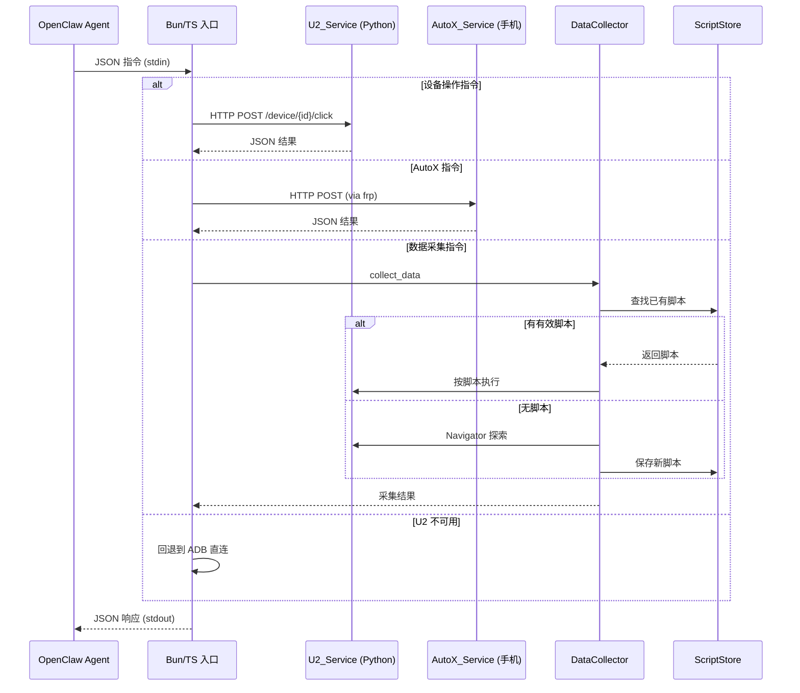

# 设计文档：OpenClaw 移动端自动化插件 (mobile-automation)

## 概述

本设计将现有的 mobile-rpa Skill 扩展为一个多 Skill 插件架构。核心思路是保持 Bun/TypeScript 入口层作为 OpenClaw 的统一接口（stdin/stdout JSON），同时引入 Python FastAPI 服务（基于 uiautomator2）提供高性能设备操作，以及 AutoX.js 手机端自动化（通过 frp 隧道远程访问）。数据采集编排器协调多种策略和自动化引擎，实现"探索→学习→复用"的智能采集循环。

技术选型理由：
- uiautomator2 (Python)：截图速度提升 24 倍（500ms vs 12s），支持中文输入、XPath 选择器、剪贴板读写
- AutoX.js：利用 Android 无障碍服务，支持手机端直接运行 JS 脚本，内置 Paddle OCR
- FastAPI + uv：轻量高性能 Python Web 框架，uv 提供快速可靠的 Python 环境管理
- frp：成熟的内网穿透工具，将手机端 HTTP 服务稳定暴露到云服务器
- 保留 Bun/TS 入口层：向后兼容现有 OpenClaw Skill 接口

## 架构

```mermaid
graph TB
    subgraph OpenClaw
        Agent[OpenClaw AI Agent]
    end

    subgraph Plugin["mobile-automation Plugin"]
        Entry[Bun/TS 入口<br/>skill-cli.ts<br/>统一指令路由]

        subgraph U2["mobile-u2 Skill (云服务器)"]
            FastAPI[FastAPI 服务<br/>端口 9400]
            DevMgr[DeviceManager<br/>uiautomator2]
            Vision[GlmVisionClient<br/>GLM-4.6V]
            VAgent[VisionAgent<br/>智能决策]
        end

        subgraph AutoX["mobile-autox Skill (手机端)"]
            AutoXApp[AutoX.js App<br/>端口 9500]
            FrpClient[frp 客户端]
        end

        subgraph Collector["mobile-data-collector Skill"]
            DC[DataCollector<br/>策略调度]
            Nav[Navigator<br/>导航管理]
            SS[ScriptStore<br/>脚本仓库]
            SV[ScriptValidator<br/>脚本验证]
            subgraph Strategies["采集策略"]
                API[ApiStrategy]
                Copy[RpaCopyStrategy]
                OCR[RpaOcrStrategy]
            end
        end

        subgraph Existing["mobile-rpa Skill (现有)"]
            ADB[ADB Client]
            SP[Screen Parser]
            AE[Action Executor]
            TE[Template Engine]
            RL[RPA Loop]
        end

        FrpServer[frp 服务端<br/>云服务器]
    end

    subgraph Phone["Android 手机 (a394960e)"]
        PhoneAutoX[AutoX.js HTTP]
        PhoneFrp[frp 客户端]
    end

    Agent -->|stdin/stdout JSON| Entry
    Entry -->|HTTP :9400| FastAPI
    Entry -->|HTTP frp映射端口| FrpServer
    Entry --> ADB
    Entry --> DC

    FastAPI --> DevMgr
    FastAPI --> Vision
    FastAPI --> VAgent
    VAgent --> Vision
    VAgent --> DevMgr

    DC --> Nav
    DC --> SS
    DC --> Strategies
    Nav --> FastAPI
    Nav --> FrpServer
    OCR --> Vision

    FrpServer -.->|隧道| PhoneFrp
    PhoneFrp --> PhoneAutoX
    DevMgr -->|uiautomator2 via ADB| Phone
    ADB -->|ADB SSH 隧道| Phone
end
```

### 请求流程



## 组件与接口

### 1. U2_Service — FastAPI 服务 (`u2-server/server.py`)

Python FastAPI 应用，封装 uiautomator2 设备操作和 GLM-4.6V 视觉分析。

```python
# REST API 端点
GET  /health                          # 健康检查
GET  /devices                         # 列出已连接设备
GET  /device/{id}/info                # 设备详细信息
POST /device/{id}/screenshot          # 截图 → base64
POST /device/{id}/click               # 点击 {x, y}
POST /device/{id}/swipe               # 滑动 {x1, y1, x2, y2, duration}
POST /device/{id}/input_text          # 输入文字 {text}（支持中文）
POST /device/{id}/key_event           # 按键 {keyCode}
POST /device/{id}/app_start           # 启动 App {package}
POST /device/{id}/app_stop            # 停止 App {package}
GET  /device/{id}/current_app         # 当前前台 App
POST /device/{id}/find_element        # 查找元素 {by, value}
POST /device/{id}/click_element       # 点击元素 {by, value}
GET  /device/{id}/clipboard           # 读剪贴板
POST /device/{id}/clipboard           # 写剪贴板 {text}
GET  /device/{id}/ui_hierarchy        # 获取 UI 树 (XML)
POST /vision/analyze                  # 截图 + GLM 分析 {deviceId, prompt}
POST /vision/smart_task               # 智能任务 {deviceId, goal, maxSteps?}
```

### 2. DeviceManager (`u2-server/device.py`)

uiautomator2 设备操作封装，管理多设备连接。

```python
class DeviceManager:
    def get_device(self, device_id: str) -> u2.Device
    def list_devices(self) -> list[dict]
    def screenshot_base64(self, device_id: str) -> str
    def click(self, device_id: str, x: int, y: int) -> None
    def swipe(self, device_id: str, x1: int, y1: int, x2: int, y2: int, duration: float) -> None
    def input_text(self, device_id: str, text: str) -> None
    def key_event(self, device_id: str, key_code: int) -> None
    def find_element(self, device_id: str, by: str, value: str) -> dict | None
    def click_element(self, device_id: str, by: str, value: str) -> bool
    def get_clipboard(self, device_id: str) -> str
    def set_clipboard(self, device_id: str, text: str) -> None
    def app_start(self, device_id: str, package: str) -> None
    def app_stop(self, device_id: str, package: str) -> None
    def current_app(self, device_id: str) -> dict
    def ui_hierarchy(self, device_id: str) -> str
```

### 3. GlmVisionClient (`u2-server/vision.py`)

GLM-4.6V 视觉模型 Python 客户端，使用 httpx 流式调用。

```python
class GlmVisionClient:
    async def analyze(self, base64_image: str, prompt: str) -> dict
    # 返回 {"success": bool, "description": str, "model": str, "error"?: str}
```

### 4. VisionAgent (`u2-server/vision_agent.py`)

视觉驱动的智能决策循环，从 TypeScript 迁移到 Python。

```python
class VisionAgent:
    async def run_task(self, device_id: str, goal: str, max_steps: int = 20) -> dict
    async def decide_next_action(self, device_id: str, goal: str, history: list[str]) -> dict
    def parse_vision_response(self, text: str) -> dict
```

### 5. AutoX 客户端 (`src/autox-client.ts`)

Bun/TS 层的 AutoX.js HTTP 客户端，通过 frp 映射端口调用手机端服务。

```typescript
interface AutoXClient {
  click(x: number, y: number): Promise<AutoXResult>;
  inputText(text: string): Promise<AutoXResult>;
  findElement(selector: AutoXSelector): Promise<AutoXElement | null>;
  ocr(): Promise<OcrResult>;
  readClipboard(): Promise<string>;
  runScript(script: string): Promise<AutoXResult>;
  healthCheck(): Promise<boolean>;
}
```

### 6. DataCollector (`u2-server/collector.py`)

数据采集调度器，按优先级尝试各策略。

```python
class DataCollector:
    STRATEGY_PRIORITY = ["api", "rpa_copy", "rpa_ocr"]

    async def collect(self, device_id: str, app: str, data_type: str,
                      query: str = "", force_strategy: str | None = None) -> dict
```

### 7. Navigator (`u2-server/navigator.py`)

导航管理器，负责到达目标 App 的目标页面。

```python
class Navigator:
    async def navigate_to(self, device_id: str, app: str, target_page: str) -> dict
    async def explore(self, device_id: str, app: str, target: str) -> dict
    async def execute_script(self, device_id: str, script: dict) -> dict
```

### 8. ScriptStore (`u2-server/script_store.py`)

脚本仓库，管理已学习的采集脚本。

```python
class ScriptStore:
    def save(self, app: str, data_type: str, strategy: str, config: dict) -> str  # 返回脚本 ID
    def find(self, app: str, data_type: str) -> dict | None
    def find_navigation(self, app: str, target_page: str) -> dict | None
    def list_all(self) -> list[dict]
    def mark_invalid(self, script_id: str) -> None
    def delete(self, script_id: str) -> bool
    def update_usage(self, script_id: str) -> None
    def update_validation(self, script_id: str, valid: bool) -> None
    def serialize(self, script: dict) -> str
    def deserialize(self, json_str: str) -> dict
```

### 9. ScriptValidator (`u2-server/validator.py`)

脚本验证器。

```python
class ScriptValidator:
    async def validate_all(self, device_id: str) -> dict
    async def validate_one(self, device_id: str, script: dict) -> bool
```

### 10. 采集策略 (`u2-server/strategies/`)

```python
# 策略基类
class BaseStrategy:
    async def explore(self, device_id: str, app: str, data_type: str, query: str) -> dict
    async def execute(self, device_id: str, script: dict) -> dict

class ApiStrategy(BaseStrategy): ...      # API 直连
class RpaCopyStrategy(BaseStrategy): ...   # RPA + 剪贴板复制
class RpaOcrStrategy(BaseStrategy): ...    # RPA + 截图 OCR
```

### 11. Bun 入口扩展 (`src/skill-cli.ts`)

扩展现有入口，新增指令路由。

```typescript
// 新增指令类型
type CommandType = 
  | /* 现有指令 */ "list_devices" | "get_screen" | "execute_action" | ...
  | /* 新增指令 */ "collect_data" | "list_scripts" | "validate_scripts" | "autox_execute";

// U2 服务 HTTP 代理
async function callU2(path: string, body?: unknown): Promise<unknown>;

// AutoX 服务 HTTP 代理
async function callAutoX(path: string, body?: unknown): Promise<unknown>;
```

## 数据模型

### 采集脚本 (Script)

```typescript
interface CollectionScript {
  id: string;                    // 唯一标识符 (UUID)
  app: string;                   // 目标 App 名称
  dataType: string;              // 数据类型（如"联系人列表"）
  strategy: "api" | "rpa_copy" | "rpa_ocr";  // 采集策略
  navigation: NavigationStep[];  // 导航步骤
  extraction: ExtractionConfig;  // 数据提取配置
  metadata: {
    createdAt: string;           // ISO 时间戳
    lastUsedAt: string;          // 最后使用时间
    lastValidatedAt: string;     // 最后验证时间
    useCount: number;            // 使用次数
    isValid: boolean;            // 是否有效
  };
}

interface NavigationStep {
  order: number;
  action: {
    type: "click" | "click_element" | "swipe" | "input_text" | "wait";
    x?: number;
    y?: number;
    selector?: { by: "text" | "resourceId" | "xpath"; value: string };
    text?: string;
    duration?: number;
  };
  description: string;
}

interface ExtractionConfig {
  type: "api" | "clipboard" | "ocr";
  config: ApiConfig | ClipboardConfig | OcrConfig;
}

interface ApiConfig {
  method: string;
  url: string;
  headers?: Record<string, string>;
  params?: Record<string, string>;
  body?: unknown;
  dataPath: string;  // JSON path 提取数据
}

interface ClipboardConfig {
  longPressX: number;
  longPressY: number;
  selectAllText: string;  // "全选" 按钮文本
  copyText: string;       // "复制" 按钮文本
}

interface OcrConfig {
  maxPages: number;       // 最大翻页数
  swipeParams: { x1: number; y1: number; x2: number; y2: number; duration: number };
  extractPrompt: string;  // GLM 提取数据的 prompt
}
```

### 采集结果

```typescript
interface CollectionResult {
  success: boolean;
  items: unknown[];           // 采集到的数据项
  strategy: string;           // 使用的策略
  scriptId?: string;          // 使用或新建的脚本 ID
  error?: string;
}
```

### AutoX 相关类型

```typescript
interface AutoXSelector {
  by: "text" | "id" | "className" | "desc";
  value: string;
}

interface AutoXElement {
  text: string;
  bounds: { left: number; top: number; right: number; bottom: number };
  className: string;
  clickable: boolean;
}

interface AutoXResult {
  success: boolean;
  data?: unknown;
  error?: string;
}

interface OcrResult {
  success: boolean;
  texts: Array<{ text: string; confidence: number; bounds: number[] }>;
}
```

### U2 服务请求/响应模型 (Python Pydantic)

```python
class ClickRequest(BaseModel):
    x: int
    y: int

class SwipeRequest(BaseModel):
    x1: int
    y1: int
    x2: int
    y2: int
    duration: float = 0.5

class InputTextRequest(BaseModel):
    text: str

class FindElementRequest(BaseModel):
    by: Literal["text", "resourceId", "xpath"]
    value: str

class VisionAnalyzeRequest(BaseModel):
    device_id: str
    prompt: str = "请描述屏幕上的内容"

class SmartTaskRequest(BaseModel):
    device_id: str
    goal: str
    max_steps: int = 20

class CollectRequest(BaseModel):
    device_id: str
    app: str
    data_type: str
    query: str = ""
    force_strategy: str | None = None

class ApiResponse(BaseModel):
    success: bool
    message: str
    data: Any = None
```

### 项目文件结构

```
~/.openclaw/workspace/skills/mobile-rpa/    # 插件根目录
├── SKILL.md                    # mobile-rpa Skill 定义（现有）
├── package.json
├── tsconfig.json
├── src/
│   ├── skill-cli.ts            # Bun 统一入口（扩展）
│   ├── types.ts                # TypeScript 类型定义（扩展）
│   ├── autox-client.ts         # AutoX.js HTTP 客户端（新增）
│   ├── u2-proxy.ts             # U2 服务 HTTP 代理（新增）
│   ├── adb-client.ts           # ADB 通信层（现有）
│   ├── screen-parser.ts        # 屏幕解析器（现有）
│   ├── action-executor.ts      # 动作执行器（现有）
│   ├── template-engine.ts      # 模板引擎（现有）
│   ├── rpa-loop.ts             # RPA 循环（现有）
│   ├── vision-client.ts        # 视觉客户端（现有）
│   ├── vision-agent.ts         # 视觉 Agent（现有）
│   └── logger.ts               # 日志模块（现有）
├── u2-server/                  # Python FastAPI 服务（新增）
│   ├── pyproject.toml          # uv 项目配置
│   ├── server.py               # FastAPI 入口
│   ├── device.py               # uiautomator2 设备操作
│   ├── vision.py               # GLM-4.6V 客户端
│   ├── vision_agent.py         # 视觉智能 Agent
│   ├── collector.py            # 数据采集调度器
│   ├── navigator.py            # 导航管理器
│   ├── script_store.py         # 脚本仓库
│   ├── validator.py            # 脚本验证器
│   ├── strategies/
│   │   ├── __init__.py
│   │   ├── base.py             # 策略基类
│   │   ├── api_strategy.py     # API 直连策略
│   │   ├── rpa_copy_strategy.py # RPA + 剪贴板策略
│   │   └── rpa_ocr_strategy.py  # RPA + OCR 策略
│   └── scripts/                # 已学习的采集脚本 (JSON)
├── autox/                      # AutoX.js 相关配置（新增）
│   ├── SKILL.md                # mobile-autox Skill 定义
│   └── autox-server.js         # AutoX.js 手机端 HTTP 服务脚本
├── skills/                     # 各 Skill 的 SKILL.md（新增）
│   ├── mobile-u2-SKILL.md
│   └── mobile-data-collector-SKILL.md
├── deploy/                     # 部署配置（新增）
│   ├── frps.toml               # frp 服务端配置
│   ├── frpc.toml               # frp 客户端配置
│   └── DEPLOY.md               # 完整部署指南
├── templates/                  # 操作模板（现有）
└── tests/                      # 测试（扩展）
    ├── u2-proxy.test.ts
    ├── autox-client.test.ts
    ├── script-store.test.ts
    └── ... (现有测试)
```


## 正确性属性 (Correctness Properties)

*正确性属性是系统在所有有效执行中都应保持为真的特征或行为——本质上是关于系统应该做什么的形式化陈述。属性作为人类可读规范与机器可验证正确性保证之间的桥梁。*

以下属性基于需求文档中的验收标准推导而来，经过冗余消除和合并优化。

### Property 1: U2 API 点击坐标接受性

*For any* 有效的坐标对 (x, y)，U2_Service 的 click 端点应接受请求并将坐标正确传递给 uiautomator2 的 click 方法。

**Validates: Requirements 2.3**

### Property 2: U2 API 文本输入（含中文）

*For any* 字符串（包括中文字符、ASCII 字符和混合字符串），U2_Service 的 input_text 端点应接受请求并将完整文本传递给 uiautomator2 的 send_keys 方法。

**Validates: Requirements 2.4**

### Property 3: U2 API 三种元素选择器支持

*For any* 元素查找请求，当 by 参数为 "text"、"resourceId" 或 "xpath" 之一时，U2_Service 应使用对应的 uiautomator2 选择器方法查找元素；当 by 参数不属于这三种时，应返回参数错误。

**Validates: Requirements 2.5**

### Property 4: 剪贴板读写往返一致性

*For any* 文本字符串，通过 U2_Service 写入设备剪贴板后再读取，应返回与写入内容相同的文本。

**Validates: Requirements 2.7**

### Property 5: 智能任务步骤上限

*For any* 智能任务请求和 max_steps 值，VisionAgent 执行的步骤数量不应超过 max_steps 指定的上限。

**Validates: Requirements 3.3**

### Property 6: 数据采集策略优先级

*For any* 数据采集请求（无强制策略参数），当多个策略可用时，Data_Collector 应按 "api" → "rpa_copy" → "rpa_ocr" 的固定优先级依次尝试，直到某个策略成功或全部失败。

**Validates: Requirements 6.1**

### Property 7: 脚本优先与探索回退

*For any* 数据采集请求，如果 Script_Store 中存在匹配目标 App 和数据类型的有效脚本，Data_Collector 应优先使用该脚本执行；如果不存在有效脚本，Data_Collector 应通过 Navigator 进行探索。

**Validates: Requirements 6.2, 6.3**

### Property 8: 采集成功后脚本保存

*For any* 成功的数据采集操作（无论使用哪种策略），Data_Collector 应将采集流程保存为新脚本到 Script_Store 中。

**Validates: Requirements 6.4**

### Property 9: 强制策略限制

*For any* 包含 force_strategy 参数的数据采集请求，Data_Collector 应仅尝试指定的策略，不应尝试其他策略。

**Validates: Requirements 6.6**

### Property 10: 采集结果格式一致性

*For any* 数据采集操作的返回结果（无论成功或失败），结果对象应包含 success（布尔值）、strategy（字符串）字段；成功时应包含 items（数组）字段。

**Validates: Requirements 6.7**

### Property 11: 脚本标识符唯一性

*For any* 两个通过 Script_Store 保存的脚本，它们的 id 字段应互不相同。

**Validates: Requirements 7.2**

### Property 12: 脚本按 App 和数据类型查找

*For any* 已保存且有效的脚本（app=X, dataType=Y），通过 (X, Y) 查找应返回该脚本；通过不同的 (X', Y') 查找不应返回该脚本。

**Validates: Requirements 7.3**

### Property 13: 脚本列表完整性

*For any* 包含 N 个脚本的 Script_Store，list_all 应返回恰好 N 个脚本摘要，每个摘要包含 id、app、dataType、strategy 和 isValid 字段。

**Validates: Requirements 7.4**

### Property 14: 脚本无效标记与查找排除

*For any* 已保存的脚本，将其标记为无效后，通过 find() 方法查找应不再返回该脚本。

**Validates: Requirements 7.5**

### Property 15: 脚本删除

*For any* 已保存的脚本，删除后通过 find() 和 list_all() 均不应包含该脚本。

**Validates: Requirements 7.6**

### Property 16: 脚本使用计数递增

*For any* 已保存的脚本，每次调用 update_usage 后，useCount 应递增 1，lastUsedAt 应更新为当前时间或更晚的时间。

**Validates: Requirements 7.7**

### Property 17: 脚本序列化/反序列化往返一致性

*For any* 有效的 CollectionScript 对象，执行 serialize 然后 deserialize 应产生与原始对象等价的脚本对象。

**Validates: Requirements 7.8**

### Property 18: 脚本验证覆盖与结果摘要

*For any* 包含 N 个脚本的 Script_Store，validate_all 应对每个脚本执行验证，返回的摘要中 total 应等于 N，且 success + failure 应等于 total。

**Validates: Requirements 8.1, 8.4**

### Property 19: 验证失败标记无效

*For any* 验证失败的脚本，Script_Validator 应将其在 Script_Store 中标记为无效状态（isValid = false）。

**Validates: Requirements 8.2**

### Property 20: 验证成功更新时间

*For any* 验证成功的脚本，Script_Validator 应更新其 lastValidatedAt 为当前时间或更晚的时间。

**Validates: Requirements 8.3**

### Property 21: 设备操作指令转发至 U2

*For any* 设备操作类指令（screenshot、click、swipe、input_text 等），Bun_Entry 应将请求通过 HTTP 转发给 U2_Service（localhost:9400）。

**Validates: Requirements 9.2**

### Property 22: AutoX 指令转发

*For any* autox_execute 类型的指令，Bun_Entry 应将请求通过 HTTP 转发给 AutoX_Service 的 frp 映射端口。

**Validates: Requirements 9.3**

### Property 23: 现有指令向后兼容

*For any* 现有的指令类型（list_devices、get_screen、execute_action、run_template、run_task、list_templates、screenshot、analyze_screen、smart_task），Bun_Entry 应继续识别并正确处理这些指令。

**Validates: Requirements 9.4**

### Property 24: 统一响应格式

*For any* 指令执行结果（包括新增和现有指令，无论成功或失败），Bun_Entry 返回的响应应始终包含 status（"success" 或 "error"）和 message（非空字符串）字段。

**Validates: Requirements 9.6**

## 错误处理

### U2_Service 错误

| 错误场景 | 处理方式 | 相关需求 |
|---------|---------|---------|
| 设备未连接或连接断开 | 返回 `{"success": false, "message": "Device not connected: {device_id}"}` | 2.10 |
| uiautomator2 操作超时 | 设置 10 秒超时，超时后返回超时错误 | 2.3-2.5 |
| 无效的元素选择器类型 | 返回 400 错误，列出支持的选择器类型 | 2.5 |
| GLM-4.6V API 调用失败 | 返回错误详情，包含 HTTP 状态码和错误信息 | 3.5 |
| GLM-4.6V API 超时 | 120 秒超时，返回超时错误 | 3.5 |

### AutoX_Service 错误

| 错误场景 | 处理方式 | 相关需求 |
|---------|---------|---------|
| frp 隧道断开 | HTTP 连接失败时返回 `{"status": "error", "message": "AutoX service unavailable (frp tunnel down)"}` | 4.8 |
| AutoX.js 脚本执行错误 | 返回脚本错误信息和堆栈 | 4.7 |
| 无障碍服务未启用 | 返回提示用户启用无障碍服务的错误信息 | 4.2 |

### Data_Collector 错误

| 错误场景 | 处理方式 | 相关需求 |
|---------|---------|---------|
| 所有策略均失败 | 返回 `{"success": false, "error": "所有策略均失败", "attempted": [...]}` | 6.1 |
| 已保存脚本执行失败 | 标记脚本为无效，继续尝试其他策略 | 6.2 |
| Navigator 探索失败 | 返回导航失败错误，包含已尝试的步骤 | 6.3 |
| 无效的 force_strategy 值 | 返回错误，列出支持的策略类型 | 6.6 |

### Bun 入口层错误

| 错误场景 | 处理方式 | 相关需求 |
|---------|---------|---------|
| U2_Service 不可用 | 回退到 ADB 直连方式 | 9.5 |
| U2_Service HTTP 调用超时 | 30 秒超时，回退到 ADB 或返回错误 | 9.2 |
| 未知指令类型 | 返回错误信息，列出所有支持的指令类型 | 9.6 |
| JSON 解析失败 | 返回格式错误信息 | 9.6 |

## 测试策略

### 测试框架选择

- TypeScript 单元/属性测试：Bun 内置测试运行器 (`bun test`) + `fast-check`
- Python 单元/属性测试：`pytest` + `hypothesis`
- HTTP API 测试：`httpx` (Python) / `fetch` (Bun)
- Mock 策略：通过依赖注入 mock 设备操作和外部 API，避免测试依赖真实设备

### 双重测试方法

**单元测试**（验证具体示例和边界情况）：
- U2_Service 各端点的请求/响应格式验证
- AutoX 客户端连接失败处理
- 新增指令类型识别（collect_data、list_scripts 等）
- frp 隧道断开时的错误处理
- 空脚本仓库的边界情况
- GLM API 超时和错误处理

**属性测试**（验证普遍性质，每个属性至少 100 次迭代）：
- 每个属性测试必须引用设计文档中的属性编号
- 标签格式：`Feature: openclaw-mobile-automation-plugin, Property N: {property_text}`
- 每个正确性属性由一个独立的属性测试实现
- Python 属性测试使用 `hypothesis` 库
- TypeScript 属性测试使用 `fast-check` 库

### 测试文件分布

| 测试文件 | 覆盖属性 | 语言 | 测试类型 |
|---------|---------|------|---------|
| `u2-server/tests/test_device.py` | Property 1-4 | Python | 属性测试 + 单元测试 |
| `u2-server/tests/test_vision.py` | Property 5 | Python | 属性测试 + 单元测试 |
| `u2-server/tests/test_collector.py` | Property 6-10 | Python | 属性测试 + 单元测试 |
| `u2-server/tests/test_script_store.py` | Property 11-17 | Python | 属性测试 + 单元测试 |
| `u2-server/tests/test_validator.py` | Property 18-20 | Python | 属性测试 + 单元测试 |
| `tests/u2-proxy.test.ts` | Property 21 | TypeScript | 属性测试 + 单元测试 |
| `tests/autox-client.test.ts` | Property 22 | TypeScript | 属性测试 + 单元测试 |
| `tests/skill-cli-extended.test.ts` | Property 23-24 | TypeScript | 属性测试 + 单元测试 |

### Mock 策略

**Python 层**：
```python
# Mock uiautomator2 设备
class MockDevice:
    def __init__(self):
        self.click_log = []
        self.clipboard = ""
    def click(self, x, y): self.click_log.append((x, y))
    def send_keys(self, text): pass
    def screenshot(self): return Image.new("RGB", (1080, 2400))
    # ...

class MockDeviceManager(DeviceManager):
    def get_device(self, device_id): return MockDevice()
```

**TypeScript 层**：
```typescript
// Mock HTTP 调用
class MockU2Proxy {
  private callLog: Array<{path: string; body?: unknown}> = [];
  async call(path: string, body?: unknown) {
    this.callLog.push({path, body});
    return {success: true, data: {}};
  }
  getCallLog() { return this.callLog; }
}
```
