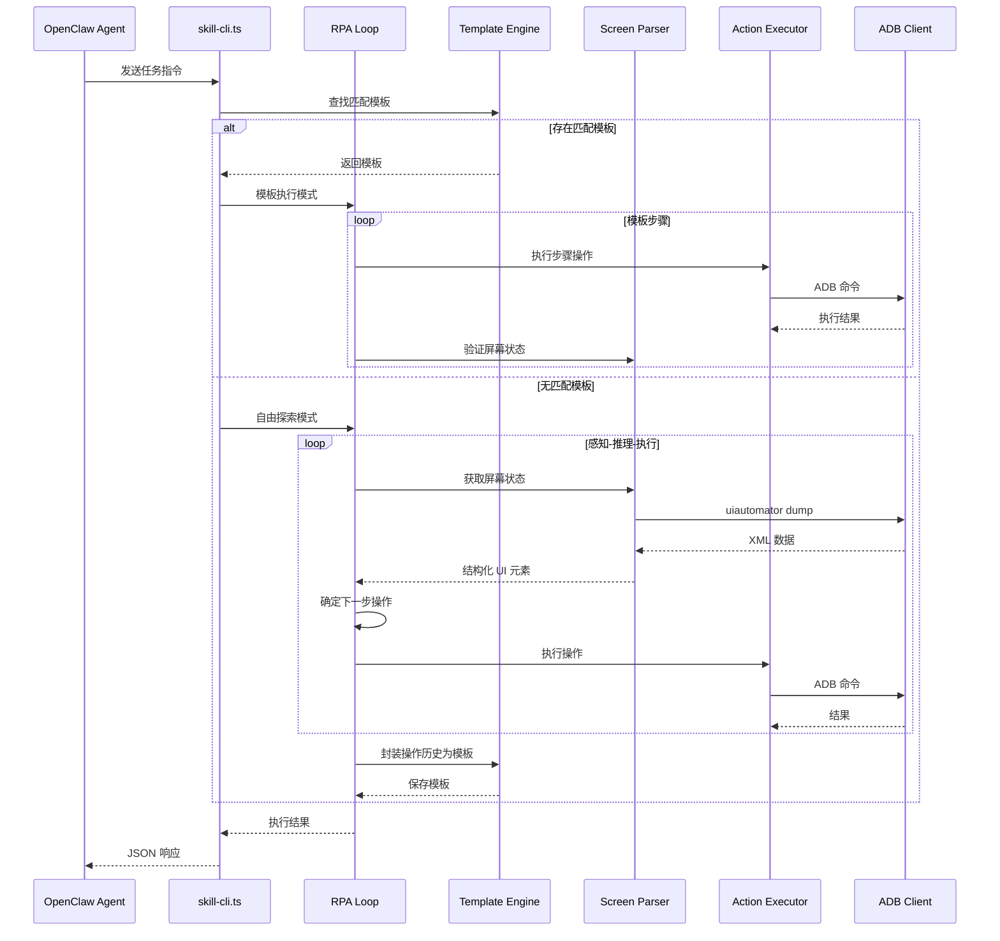

# 设计文档：OpenClaw 移动端 RPA Skill

## 概述

本设计实现一个 OpenClaw 移动端 RPA Skill，采用 TypeScript + Bun 运行时构建（参考 DroidClaw 架构）。Skill 通过 ADB 与 Android 设备通信，支持屏幕状态感知、基础操作执行、操作模板管理，以及"自由探索→自动封装→模板复用"的双模式 RPA 循环。

技术选型理由：
- TypeScript：类型安全，适合复杂数据结构（Accessibility Tree、模板 schema）
- Bun：快速启动、原生 TypeScript 支持、内置 shell 命令执行
- ADB：无需 root，通过 USB/WiFi 连接即可控制 Android 设备

## 架构

```mermaid
graph TB
    subgraph OpenClaw
        Agent[OpenClaw AI Agent]
    end

    subgraph Skill["mobile-rpa Skill"]
        SKILL_MD[SKILL.md]
        CLI[skill-cli.ts<br/>入口脚本]
        
        subgraph Core["核心模块"]
            SP[Screen Parser<br/>屏幕解析器]
            AE[Action Executor<br/>动作执行器]
            TE[Template Engine<br/>模板引擎]
            RL[RPA Loop<br/>自动化循环]
        end
        
        subgraph Infra["基础设施"]
            ADB_Client[ADB Client<br/>设备通信层]
            Logger[Logger<br/>日志模块]
        end
    end

    subgraph Device["Android 设备"]
        Phone[Android Phone via ADB]
    end

    Agent -->|调用| CLI
    CLI --> SP
    CLI --> AE
    CLI --> TE
    CLI --> RL
    SP --> ADB_Client
    AE --> ADB_Client
    RL --> SP
    RL --> AE
    RL --> TE
    ADB_Client -->|ADB 命令| Phone
    CLI --> Logger
```



### 执行流程



## 组件与接口

### 1. ADB Client (`adb-client.ts`)

设备通信底层，封装所有 ADB 命令调用。

```typescript
interface AdbClient {
  // 设备管理
  listDevices(): Promise<DeviceInfo[]>;
  isConnected(deviceId: string): Promise<boolean>;
  
  // 屏幕获取
  dumpUiHierarchy(deviceId: string): Promise<string>; // 返回原始 XML
  
  // 操作执行
  tap(deviceId: string, x: number, y: number): Promise<void>;
  inputText(deviceId: string, text: string): Promise<void>;
  swipe(deviceId: string, x1: number, y1: number, x2: number, y2: number, durationMs: number): Promise<void>;
  keyEvent(deviceId: string, keyCode: number): Promise<void>;
  
  // 通用命令
  shell(deviceId: string, command: string): Promise<string>;
}
```

### 2. Screen Parser (`screen-parser.ts`)

解析 Accessibility Tree，提取结构化 UI 元素。

```typescript
interface ScreenParser {
  // 获取并解析屏幕状态
  captureScreen(deviceId: string): Promise<ScreenState>;
  
  // 计算两次屏幕状态差异
  diffScreens(prev: ScreenState, curr: ScreenState): ScreenDiff;
  
  // 从原始 XML 解析 UI 元素
  parseAccessibilityTree(xml: string): UiElement[];
}
```

### 3. Action Executor (`action-executor.ts`)

将抽象操作指令转换为 ADB 命令并执行。

```typescript
interface ActionExecutor {
  // 执行单个操作
  execute(deviceId: string, action: Action): Promise<ActionResult>;
  
  // 批量执行操作序列
  executeBatch(deviceId: string, actions: Action[]): Promise<ActionResult[]>;
  
  // 验证设备连接
  validateConnection(deviceId: string): Promise<boolean>;
}
```

### 4. Template Engine (`template-engine.ts`)

模板的加载、验证、参数替换、执行和自动生成。

```typescript
interface TemplateEngine {
  // 模板管理
  loadTemplates(dir: string): Promise<OperationTemplate[]>;
  getTemplate(name: string): OperationTemplate | undefined;
  listTemplates(): TemplateSummary[];
  saveTemplate(template: OperationTemplate, dir: string): Promise<void>;
  
  // 模板验证
  validateTemplate(template: unknown): ValidationResult;
  
  // 参数处理
  resolveParams(template: OperationTemplate, params: Record<string, string>): ResolvedTemplate;
  
  // 从操作历史生成模板
  generateFromHistory(history: ExecutionHistory, taskName: string): OperationTemplate;
  
  // 查找匹配模板
  findMatchingTemplate(taskDescription: string): OperationTemplate | undefined;
  
  // 序列化/反序列化
  serialize(template: OperationTemplate): string;
  deserialize(json: string): OperationTemplate;
}
```

### 5. RPA Loop (`rpa-loop.ts`)

双模式自动化循环控制器。

```typescript
interface RpaLoop {
  // 自由探索模式
  runExploration(deviceId: string, goal: string, options?: LoopOptions): Promise<ExplorationResult>;
  
  // 模板执行模式
  runTemplate(deviceId: string, template: ResolvedTemplate): Promise<TemplateExecutionResult>;
  
  // 卡住检测
  detectStuck(history: StepRecord[]): boolean;
}
```

### 6. Skill CLI (`skill-cli.ts`)

入口脚本，处理 OpenClaw Agent 的指令调用。

```typescript
interface SkillCli {
  // 处理指令
  handleCommand(input: string): Promise<SkillResponse>;
  
  // 指令路由
  routeCommand(command: ParsedCommand): Promise<SkillResponse>;
}
```

## 数据模型

```typescript
// === 设备相关 ===
interface DeviceInfo {
  id: string;           // 设备序列号
  model: string;        // 设备型号
  status: "device" | "offline" | "unauthorized";
}

// === 屏幕状态相关 ===
interface UiElement {
  id: string;           // 唯一标识符 (e.g., "elem_0", "elem_1")
  type: string;         // 元素类型 (Button, EditText, TextView, etc.)
  text: string;         // 文本内容
  contentDesc: string;  // 内容描述
  bounds: Bounds;       // 坐标范围
  clickable: boolean;
  scrollable: boolean;
  focusable: boolean;
  enabled: boolean;
  resourceId: string;   // Android resource ID
  className: string;    // 完整类名
}

interface Bounds {
  left: number;
  top: number;
  right: number;
  bottom: number;
}

interface ScreenState {
  timestamp: number;
  deviceId: string;
  elements: UiElement[];
  rawXml: string;
}

interface ScreenDiff {
  added: UiElement[];
  removed: UiElement[];
  changed: Array<{ before: UiElement; after: UiElement }>;
}

// === 操作相关 ===
type Action =
  | { type: "tap"; x: number; y: number }
  | { type: "tap_element"; elementId: string }
  | { type: "input_text"; text: string }
  | { type: "swipe"; x1: number; y1: number; x2: number; y2: number; duration: number }
  | { type: "key_event"; keyCode: number }
  | { type: "wait"; ms: number };

interface ActionResult {
  success: boolean;
  action: Action;
  error?: string;
  durationMs: number;
}

// === 模板相关 ===
interface OperationTemplate {
  name: string;
  description: string;
  params: TemplateParam[];
  steps: TemplateStep[];
  metadata: {
    createdAt: string;
    source: "manual" | "auto-generated";
    taskDescription?: string;
  };
}

interface TemplateParam {
  name: string;
  description: string;
  required: boolean;
  defaultValue?: string;
}

interface TemplateStep {
  order: number;
  action: Action;
  description: string;
  expectedScreenHint?: string; // 可选：期望的屏幕状态提示
}

interface ResolvedTemplate {
  name: string;
  steps: TemplateStep[];  // 参数已替换
}

interface TemplateSummary {
  name: string;
  description: string;
  params: TemplateParam[];
}

interface ValidationResult {
  valid: boolean;
  errors: string[];
}

// === RPA 循环相关 ===
interface StepRecord {
  stepNumber: number;
  screenSummary: string;
  action: Action;
  result: ActionResult;
  timestamp: number;
}

interface ExecutionHistory {
  taskGoal: string;
  steps: StepRecord[];
  startTime: number;
  endTime: number;
}

interface LoopOptions {
  maxSteps: number;       // 默认 30
  stuckThreshold: number; // 默认 3
  timeoutMs: number;      // 默认 300000 (5分钟)
}

interface ExplorationResult {
  success: boolean;
  history: ExecutionHistory;
  generatedTemplate?: OperationTemplate;
  message: string;
}

interface TemplateExecutionResult {
  success: boolean;
  stepsCompleted: number;
  totalSteps: number;
  stepResults: ActionResult[];
  message: string;
}

// === 指令与响应 ===
type CommandType = "list_devices" | "get_screen" | "execute_action" | "run_template" | "run_task" | "list_templates";

interface ParsedCommand {
  type: CommandType;
  deviceId?: string;
  action?: Action;
  templateName?: string;
  templateParams?: Record<string, string>;
  taskGoal?: string;
}

interface SkillResponse {
  status: "success" | "error";
  message: string;
  data?: unknown;
}
```

## 文件结构

```
~/.openclaw/workspace/skills/mobile-rpa/
├── SKILL.md                  # OpenClaw Skill 定义文件
├── package.json              # 依赖管理
├── tsconfig.json             # TypeScript 配置
├── src/
│   ├── skill-cli.ts          # 入口脚本
│   ├── types.ts              # 所有类型定义
│   ├── adb-client.ts         # ADB 通信层
│   ├── screen-parser.ts      # 屏幕解析器
│   ├── action-executor.ts    # 动作执行器
│   ├── template-engine.ts    # 模板引擎
│   ├── rpa-loop.ts           # RPA 循环控制器
│   └── logger.ts             # 日志模块
├── templates/                # 操作模板目录
│   └── example-open-app.json # 示例模板
└── tests/
    ├── screen-parser.test.ts
    ├── template-engine.test.ts
    ├── action-executor.test.ts
    └── rpa-loop.test.ts
```

## 正确性属性 (Correctness Properties)

*正确性属性是系统在所有有效执行中都应保持为真的特征或行为——本质上是关于系统应该做什么的形式化陈述。属性作为人类可读规范与机器可验证正确性保证之间的桥梁。*

以下属性基于需求文档中的验收标准推导而来，经过冗余消除和合并优化。

### Property 1: Accessibility Tree 解析正确性

*For any* 有效的 Accessibility Tree XML 字符串，Screen_Parser 解析后生成的 UiElement 列表中，每个元素的 type、text、bounds、clickable 等字段应与原始 XML 中对应节点的属性值一致。

**Validates: Requirements 3.2**

### Property 2: 不可见/不可交互元素过滤

*For any* 包含可见与不可见、可交互与不可交互元素混合的 Accessibility Tree，Screen_Parser 解析后的元素列表长度应小于或等于原始 XML 中所有节点的数量，且结果中不包含不可见且不可交互的元素。

**Validates: Requirements 3.3**

### Property 3: 元素标识符唯一性

*For any* 解析后的 ScreenState，其中所有 UiElement 的 id 字段应互不相同。

**Validates: Requirements 3.4**

### Property 4: 屏幕差异计算正确性

*For any* 两个 ScreenState（prev 和 curr），diffScreens 返回的 added 元素应仅包含 curr 中存在但 prev 中不存在的元素，removed 元素应仅包含 prev 中存在但 curr 中不存在的元素，changed 元素应仅包含两者中都存在但属性发生变化的元素。

**Validates: Requirements 3.5**

### Property 5: Action 到 ADB 命令生成正确性

*For any* 有效的 Action 对象（tap、input_text、swipe、key_event 类型），Action_Executor 生成的 ADB 命令字符串应正确编码操作类型和所有参数，且每次执行后返回的 ActionResult 应包含 success 布尔值和 action 引用。

**Validates: Requirements 4.1, 4.2, 4.3, 4.4, 4.6**

### Property 6: 模板序列化/反序列化往返一致性

*For any* 有效的 OperationTemplate 对象，执行 serialize 然后 deserialize 应产生与原始对象等价的模板对象。

**Validates: Requirements 5.1, 5.8**

### Property 7: 模板格式验证正确性

*For any* 输入对象，如果该对象包含所有必填字段（name、description、params、steps）且步骤结构正确，validateTemplate 应返回 valid=true；如果缺少必填字段或结构错误，应返回 valid=false 并列出具体错误。

**Validates: Requirements 5.2**

### Property 8: 模板参数替换完整性

*For any* 包含 `{{paramName}}` 占位符的模板和一组完整的参数值，resolveParams 后的模板步骤中不应再包含任何 `{{...}}` 占位符，且每个占位符应被替换为对应的参数值。

**Validates: Requirements 5.3**

### Property 9: 缺失必填参数拒绝

*For any* 包含 N 个必填参数的模板，如果提供的参数集合缺少其中任意一个必填参数，resolveParams 应抛出错误并在错误信息中列出所有缺失的参数名称。

**Validates: Requirements 5.5**

### Property 10: 模板目录加载完整性

*For any* 包含 N 个有效 JSON 模板文件的目录，loadTemplates 应返回恰好 N 个模板对象，且每个模板的 name 应与对应文件中的 name 字段一致。

**Validates: Requirements 5.6**

### Property 11: 操作历史到模板生成正确性

*For any* 成功完成的 ExecutionHistory（包含至少一个步骤），generateFromHistory 应生成一个有效的 OperationTemplate，其步骤数量等于历史记录中的步骤数量，且 metadata.source 为 "auto-generated"。

**Validates: Requirements 5b.1, 5b.2, 5b.3, 6.6**

### Property 12: 双模式选择逻辑

*For any* 任务描述，如果存在匹配的已保存模板，RPA_Loop 应选择模板执行模式；如果不存在匹配模板，应选择自由探索模式。模式选择结果应与 findMatchingTemplate 的返回值一致。

**Validates: Requirements 6.1, 6.2**

### Property 13: 步骤记录完整性

*For any* RPA_Loop 执行（无论哪种模式），每个 StepRecord 应包含非空的 stepNumber（从 1 递增）、screenSummary 和 action 字段。

**Validates: Requirements 6.3**

### Property 14: 最大步骤数限制

*For any* RPA_Loop 执行，执行的步骤数量不应超过 LoopOptions.maxSteps 指定的上限值。

**Validates: Requirements 6.4**

### Property 15: 卡住状态检测

*For any* 步骤历史记录，如果最近连续 3 个步骤的 action 相同且 screenSummary 相同，detectStuck 应返回 true；否则应返回 false。

**Validates: Requirements 6.5**

### Property 16: 响应格式一致性

*For any* Skill 指令执行（无论成功或失败），返回的 SkillResponse 应始终包含 status（"success" 或 "error"）和 message（非空字符串）字段。

**Validates: Requirements 7.2**

### Property 17: 未知指令错误处理

*For any* 不属于已定义 CommandType 的指令字符串，Skill 应返回 status="error" 的响应，且 message 中应包含所有支持的指令类型列表。

**Validates: Requirements 7.3**

### Property 18: 设备序列号选择

*For any* 已连接设备列表和列表中任意一个设备的序列号，通过该序列号指定目标设备时，应正确选中对应设备。

**Validates: Requirements 2.3**

### Property 19: 执行前连接验证

*For any* Action 执行请求，如果目标设备未连接（isConnected 返回 false），Action_Executor 应拒绝执行并返回连接错误，不应尝试发送 ADB 命令。

**Validates: Requirements 2.4**

## 错误处理

### ADB 通信错误

| 错误场景 | 处理方式 | 相关需求 |
|---------|---------|---------|
| ADB 未安装或不在 PATH 中 | 启动时检测，返回安装指引错误信息 | 2.1 |
| 无设备连接 | 返回 `{status: "error", message: "No devices connected"}` | 2.2 |
| 设备未授权 | 返回错误信息，提示用户在手机上确认 USB 调试授权 | 2.1 |
| 操作执行中设备断开 | 捕获 ADB 命令执行异常，停止当前操作，返回连接丢失错误 | 2.5 |
| ADB 命令超时 | 使用 AbortController 设置超时，超时后终止命令并返回超时错误 | 4.7 |
| Accessibility Tree 获取失败 | 返回描述性错误，包含 ADB 原始错误信息 | 3.6 |

### 模板引擎错误

| 错误场景 | 处理方式 | 相关需求 |
|---------|---------|---------|
| 模板 JSON 格式错误 | 返回解析错误及行号信息 | 5.2 |
| 模板缺少必填字段 | 返回 ValidationResult 列出所有缺失字段 | 5.2 |
| 必填参数未提供 | 拒绝执行，列出所有缺失参数名称 | 5.5 |
| 模板文件读取失败 | 跳过该文件，记录警告日志，继续加载其他模板 | 5.6 |

### RPA 循环错误

| 错误场景 | 处理方式 | 相关需求 |
|---------|---------|---------|
| 达到最大步骤数 | 停止循环，返回 `{success: false, message: "Max steps reached"}` 及已执行历史 | 6.4 |
| 检测到卡住状态 | 尝试替代操作（如按返回键），如仍卡住则终止 | 6.5 |
| 自由探索模式超时 | 停止循环，返回超时错误及已执行历史 | 6.4 |

## 测试策略

### 测试框架选择

- 单元测试：Bun 内置测试运行器 (`bun test`)
- 属性测试：`fast-check` 库（TypeScript 生态最成熟的属性测试库）
- ADB 交互：通过依赖注入 mock ADB Client，避免测试依赖真实设备

### 双重测试方法

**单元测试**（验证具体示例和边界情况）：
- SKILL.md 文件结构验证（需求 1.1, 1.4）
- 空设备列表错误处理（需求 2.2）
- ADB 命令超时处理（需求 4.7）
- 等待操作时间验证（需求 4.5）
- 已知指令类型识别（需求 7.1）
- 日志文件写入验证（需求 7.5）

**属性测试**（验证普遍性质，每个属性至少 100 次迭代）：
- 每个属性测试必须引用设计文档中的属性编号
- 标签格式：`Feature: openclaw-mobile-rpa-skill, Property N: {property_text}`
- 每个正确性属性由一个独立的属性测试实现

### 测试文件分布

| 测试文件 | 覆盖属性 | 测试类型 |
|---------|---------|---------|
| `screen-parser.test.ts` | Property 1-4 | 属性测试 + 单元测试 |
| `action-executor.test.ts` | Property 5, 18, 19 | 属性测试 + 单元测试 |
| `template-engine.test.ts` | Property 6-11 | 属性测试 + 单元测试 |
| `rpa-loop.test.ts` | Property 12-15 | 属性测试 + 单元测试 |
| `skill-cli.test.ts` | Property 16-17 | 属性测试 + 单元测试 |

### Mock 策略

ADB Client 通过接口注入，测试时使用 mock 实现：

```typescript
// Mock ADB Client for testing
class MockAdbClient implements AdbClient {
  private devices: DeviceInfo[] = [];
  private screenXml: string = "";
  private commandLog: string[] = [];
  
  setDevices(devices: DeviceInfo[]) { this.devices = devices; }
  setScreenXml(xml: string) { this.screenXml = xml; }
  getCommandLog() { return this.commandLog; }
  
  async listDevices() { return this.devices; }
  async dumpUiHierarchy(deviceId: string) { return this.screenXml; }
  async tap(deviceId: string, x: number, y: number) {
    this.commandLog.push(`tap ${x} ${y}`);
  }
  // ... 其他方法类似
}
```
