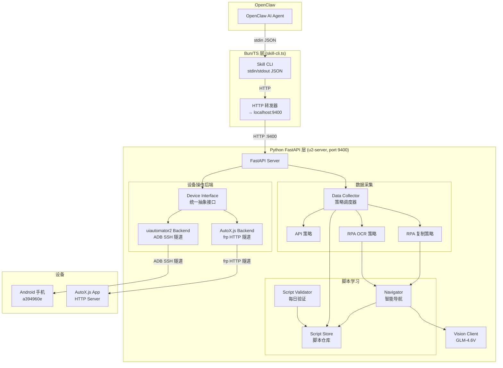
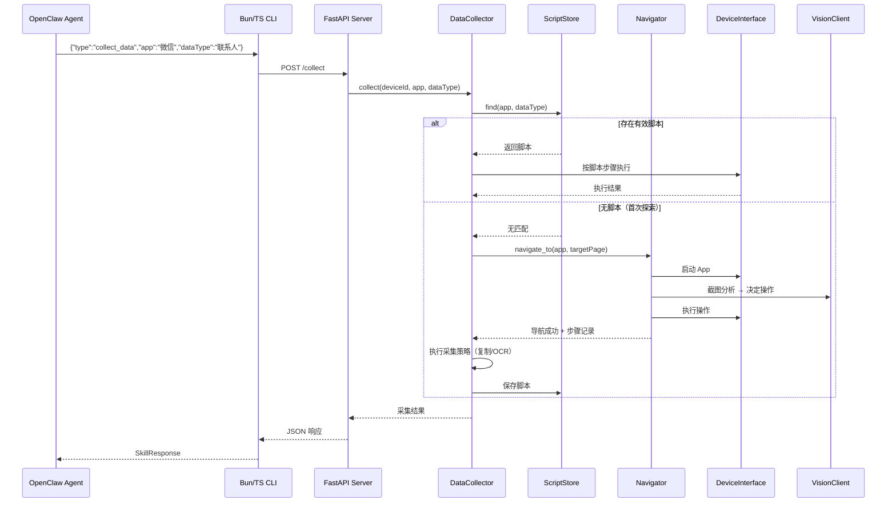

# 设计文档：智能数据采集系统

## 概述

本设计在现有 Bun/TS 移动端 RPA Skill 基础上，新增 Python FastAPI 服务层（u2-server），构建多策略、可学习的智能数据采集系统。

核心设计思路：
- **双层架构**：Bun/TS 层保持 OpenClaw Skill 接口不变（stdin/stdout JSON），Python 层利用 uiautomator2 生态获得高性能设备操作
- **双 RPA 后端**：uiautomator2（通过 ADB SSH 隧道）和 AutoX.js（通过 frp HTTP 隧道）同时可用，统一接口抽象差异
- **多策略降级**：API 直连 > RPA 复制粘贴 > 截图 OCR，按优先级自动降级
- **脚本学习复用**：首次探索自动保存脚本，后续直接复用，每日验证有效性

技术选型理由：
- Python + uv：uiautomator2 是 Python 库，uv 提供快速的环境和依赖管理
- FastAPI + uvicorn：高性能异步 Web 框架，适合设备操作的 I/O 密集场景
- frp：成熟的内网穿透方案，将手机上 AutoX.js HTTP 服务暴露到云服务器

## 架构



### 请求流程



## 组件与接口

### 1. FastAPI Server (`server.py`)

服务入口，定义所有 HTTP 端点，初始化各组件。

```python
# 端点概览
GET  /health                       # 健康检查
GET  /devices                      # 列出设备
GET  /backends                     # 列出后端及状态
POST /backend/switch               # 切换默认后端

# 设备操作（通过统一接口）
POST /device/{id}/screenshot       # 截图 (base64)
POST /device/{id}/click            # 点击
POST /device/{id}/swipe            # 滑动
POST /device/{id}/input_text       # 输入文字
POST /device/{id}/key_event        # 按键
POST /device/{id}/app_start        # 启动 App
POST /device/{id}/app_stop         # 停止 App
GET  /device/{id}/current_app      # 当前前台 App
POST /device/{id}/find_element     # 查找元素
POST /device/{id}/click_element    # 点击元素
GET  /device/{id}/clipboard        # 读剪贴板
POST /device/{id}/clipboard        # 写剪贴板
GET  /device/{id}/ui_hierarchy     # UI 层级树

# 视觉分析
POST /vision/analyze               # 截图 + GLM 分析

# 数据采集
POST /collect                      # 采集数据
GET  /scripts                      # 列出脚本
POST /scripts/validate             # 验证脚本
DELETE /scripts/{id}               # 删除脚本
```

### 2. Device Interface (`device_interface.py`)

统一设备操作抽象接口，uiautomator2 和 AutoX.js 后端分别实现。

```python
from abc import ABC, abstractmethod

class DeviceInterface(ABC):
    """统一设备操作接口"""
    
    @abstractmethod
    async def screenshot(self, device_id: str) -> str:
        """截图，返回 base64 PNG"""
        ...
    
    @abstractmethod
    async def click(self, device_id: str, x: int, y: int) -> None:
        ...
    
    @abstractmethod
    async def swipe(self, device_id: str, x1: int, y1: int, 
                    x2: int, y2: int, duration_ms: int) -> None:
        ...
    
    @abstractmethod
    async def input_text(self, device_id: str, text: str) -> None:
        """输入文本，支持中文"""
        ...
    
    @abstractmethod
    async def key_event(self, device_id: str, key_code: int) -> None:
        ...
    
    @abstractmethod
    async def find_element(self, device_id: str, 
                           by: str, value: str) -> dict | None:
        """查找元素，by: text/resourceId/xpath"""
        ...
    
    @abstractmethod
    async def click_element(self, device_id: str, 
                            by: str, value: str) -> None:
        ...
    
    @abstractmethod
    async def get_clipboard(self, device_id: str) -> str:
        ...
    
    @abstractmethod
    async def set_clipboard(self, device_id: str, text: str) -> None:
        ...
    
    @abstractmethod
    async def app_start(self, device_id: str, package: str) -> None:
        ...
    
    @abstractmethod
    async def app_stop(self, device_id: str, package: str) -> None:
        ...
    
    @abstractmethod
    async def current_app(self, device_id: str) -> dict:
        """返回 {"package": str, "activity": str}"""
        ...
    
    @abstractmethod
    async def ui_hierarchy(self, device_id: str) -> str:
        """返回 UI 层级 XML"""
        ...
    
    @abstractmethod
    async def is_connected(self, device_id: str) -> bool:
        ...
    
    @property
    @abstractmethod
    def backend_name(self) -> str:
        ...
```

### 3. uiautomator2 Backend (`u2_backend.py`)

基于 uiautomator2 库实现 DeviceInterface。

```python
class U2Backend(DeviceInterface):
    """uiautomator2 后端，通过 ADB SSH 隧道连接设备"""
    
    def __init__(self):
        self._devices: dict[str, u2.Device] = {}
    
    @property
    def backend_name(self) -> str:
        return "uiautomator2"
    
    def _get_device(self, device_id: str) -> u2.Device:
        if device_id not in self._devices:
            self._devices[device_id] = u2.connect(device_id)
        return self._devices[device_id]
    
    async def screenshot(self, device_id: str) -> str:
        d = self._get_device(device_id)
        img = d.screenshot()  # PIL Image, ~500ms
        buf = BytesIO()
        img.save(buf, format="PNG")
        return base64.b64encode(buf.getvalue()).decode()
    
    # ... 其他方法类似，调用 u2.Device 对应方法
```

### 4. AutoX.js Backend (`autox_backend.py`)

通过 frp HTTP 隧道调用手机上 AutoX.js 的 HTTP API。

```python
class AutoXBackend(DeviceInterface):
    """AutoX.js 后端，通过 frp 隧道连接"""
    
    def __init__(self, tunnel_url: str = "http://localhost:9401"):
        self.tunnel_url = tunnel_url
        self._client = httpx.AsyncClient(timeout=30)
    
    @property
    def backend_name(self) -> str:
        return "autox"
    
    async def screenshot(self, device_id: str) -> str:
        resp = await self._client.get(f"{self.tunnel_url}/screenshot")
        return resp.json()["base64"]
    
    async def click(self, device_id: str, x: int, y: int) -> None:
        await self._client.post(
            f"{self.tunnel_url}/click", json={"x": x, "y": y}
        )
    
    async def is_connected(self, device_id: str) -> bool:
        try:
            resp = await self._client.get(
                f"{self.tunnel_url}/health", timeout=5
            )
            return resp.status_code == 200
        except Exception:
            return False
    
    # ... 其他方法类似，转换为 AutoX.js HTTP API 调用
```

### 5. Backend Manager (`backend_manager.py`)

管理后端实例，支持运行时切换。

```python
class BackendManager:
    """后端管理器，维护后端实例和默认选择"""
    
    def __init__(self):
        self._backends: dict[str, DeviceInterface] = {}
        self._default_backend: str = "uiautomator2"
    
    def register(self, backend: DeviceInterface) -> None:
        self._backends[backend.backend_name] = backend
    
    def get_backend(self, name: str | None = None) -> DeviceInterface:
        key = name or self._default_backend
        if key not in self._backends:
            raise ValueError(f"Backend not found: {key}")
        return self._backends[key]
    
    def switch_default(self, name: str) -> None:
        if name not in self._backends:
            raise ValueError(f"Backend not found: {name}")
        self._default_backend = name
    
    async def list_backends(self) -> list[dict]:
        result = []
        for name, backend in self._backends.items():
            connected = await backend.is_connected("default")
            result.append({
                "name": name,
                "is_default": name == self._default_backend,
                "connected": connected,
            })
        return result
```

### 6. Vision Client (`vision.py`)

GLM-4.6V 视觉模型客户端，从 TS 版迁移到 Python，使用 httpx 异步调用。

```python
class GlmVisionClient:
    """GLM-4.6V 视觉模型客户端"""
    
    def __init__(self, api_key: str, model: str = "glm-4.6v"):
        self.api_key = api_key
        self.model = model
        self.base_url = "https://open.bigmodel.cn/api/paas/v4/chat/completions"
    
    async def analyze(self, base64_image: str, prompt: str) -> dict:
        """发送图片+prompt，流式接收结果，返回 {success, description, error?}"""
        async with httpx.AsyncClient(timeout=120) as client:
            resp = await client.post(
                self.base_url,
                headers={"Authorization": f"Bearer {self.api_key}"},
                json={
                    "model": self.model,
                    "max_tokens": 500,
                    "stream": True,
                    "messages": [{
                        "role": "user",
                        "content": [
                            {"type": "image_url", "image_url": {"url": base64_image}},
                            {"type": "text", "text": prompt},
                        ]
                    }]
                }
            )
            # 流式读取 SSE 响应，拼接 content
            content = await self._read_sse(resp)
            return {"success": True, "description": content, "model": self.model}
```

### 7. Navigator (`navigator.py`)

智能导航管理器，优先用已有脚本，无脚本时视觉探索。

```python
class Navigator:
    """导航管理器：到达目标 App 的目标页面"""
    
    def __init__(self, backend_mgr: BackendManager, 
                 vision: GlmVisionClient, script_store: ScriptStore):
        self.backend_mgr = backend_mgr
        self.vision = vision
        self.scripts = script_store
        self.max_explore_steps = 15
    
    async def navigate_to(self, device_id: str, app: str, 
                          target_page: str, backend: str = None) -> dict:
        """导航到目标页面，返回 {success, steps, error?}"""
        device = self.backend_mgr.get_backend(backend)
        
        # 1. 启动目标 App
        await device.app_start(device_id, app)
        
        # 2. 查找已有导航脚本
        script = self.scripts.find_navigation(app, target_page)
        if script and script["metadata"]["is_valid"]:
            return await self._execute_script(device_id, device, script)
        
        # 3. 视觉探索
        result = await self._explore(device_id, device, app, target_page)
        
        # 4. 成功则保存脚本
        if result["success"]:
            self.scripts.save_navigation(app, target_page, result["steps"])
        
        return result
```

### 8. Data Collector (`collector.py`)

数据采集调度器，按优先级尝试各策略。

```python
class DataCollector:
    """数据采集调度器"""
    
    STRATEGY_PRIORITY = ["api", "rpa_copy", "rpa_ocr"]
    
    def __init__(self, backend_mgr: BackendManager, vision: GlmVisionClient,
                 navigator: Navigator, script_store: ScriptStore):
        self.strategies: dict[str, CollectionStrategy] = {
            "api": ApiStrategy(),
            "rpa_copy": RpaCopyStrategy(backend_mgr, navigator),
            "rpa_ocr": RpaOcrStrategy(backend_mgr, navigator, vision),
        }
        self.scripts = script_store
        self.navigator = navigator
    
    async def collect(self, device_id: str, app: str, data_type: str,
                      query: str = "", force_strategy: str = None,
                      backend: str = None) -> dict:
        """采集数据，返回 {success, items, strategy, error?}"""
        
        # 1. 查找已有脚本
        script = self.scripts.find(app, data_type)
        if script and script["metadata"]["is_valid"]:
            result = await self._execute_script(device_id, script, backend)
            if result["success"]:
                self.scripts.update_usage(script["id"])
                return result
            self.scripts.mark_invalid(script["id"])
        
        # 2. 按优先级尝试策略
        strategies = [force_strategy] if force_strategy else self.STRATEGY_PRIORITY
        errors = []
        
        for name in strategies:
            strategy = self.strategies.get(name)
            if not strategy:
                continue
            result = await strategy.explore(device_id, app, data_type, query, backend)
            if result["success"]:
                self.scripts.save(app, data_type, name, result.get("script_config", {}))
                return result
            errors.append(f"{name}: {result.get('error', 'unknown')}")
        
        return {"success": False, "error": f"所有策略均失败: {'; '.join(errors)}"}
```

### 9. Collection Strategies (`strategies/`)

三种采集策略，共享基类。

```python
class CollectionStrategy(ABC):
    """采集策略基类"""
    
    @abstractmethod
    async def explore(self, device_id: str, app: str, 
                      data_type: str, query: str,
                      backend: str = None) -> dict:
        """探索采集，返回 {success, items, strategy, script_config?, error?}"""
        ...
    
    @abstractmethod
    async def execute(self, device_id: str, script: dict,
                      backend: str = None) -> dict:
        """按脚本执行采集"""
        ...


class ApiStrategy(CollectionStrategy):
    """API 直连策略 — 直接调用已配置的 API 端点"""
    # 通过 httpx 调用 API，按 dataPath 提取数据

class RpaCopyStrategy(CollectionStrategy):
    """RPA 复制粘贴策略 — 导航→长按→全选→复制→读剪贴板"""
    # 适合文本数据，速度快

class RpaOcrStrategy(CollectionStrategy):
    """RPA 截图 OCR 策略 — 导航→截图→GLM-4.6V 提取→翻页"""
    # 兜底策略，最通用，支持多页采集
```

### 10. Script Store (`script_store.py`)

脚本仓库，JSON 文件存储，支持 CRUD 和检索。

```python
class ScriptStore:
    """脚本仓库 — 存储、检索、管理采集脚本"""
    
    def __init__(self, scripts_dir: str = "scripts"):
        self.scripts_dir = scripts_dir
    
    def find(self, app: str, data_type: str) -> dict | None:
        """按 App 和数据类型查找匹配脚本"""
        ...
    
    def find_navigation(self, app: str, target_page: str) -> dict | None:
        """查找导航脚本"""
        ...
    
    def save(self, app: str, data_type: str, strategy: str, 
             config: dict) -> str:
        """保存采集脚本，返回脚本 ID"""
        ...
    
    def save_navigation(self, app: str, target_page: str, 
                        steps: list) -> str:
        """保存导航脚本"""
        ...
    
    def mark_invalid(self, script_id: str) -> None:
        """标记脚本为无效"""
        ...
    
    def update_usage(self, script_id: str) -> None:
        """更新使用时间和次数"""
        ...
    
    def list_all(self) -> list[dict]:
        """列出所有脚本摘要"""
        ...
    
    def delete(self, script_id: str) -> bool:
        """删除脚本"""
        ...
    
    def serialize(self, script: dict) -> str:
        """脚本对象 → JSON 字符串"""
        ...
    
    def deserialize(self, json_str: str) -> dict:
        """JSON 字符串 → 脚本对象"""
        ...
```

### 11. Script Validator (`validator.py`)

脚本验证器，逐个执行导航步骤验证有效性。

```python
class ScriptValidator:
    """脚本验证器 — 验证已保存脚本的有效性"""
    
    def __init__(self, backend_mgr: BackendManager, 
                 script_store: ScriptStore):
        self.backend_mgr = backend_mgr
        self.scripts = script_store
    
    async def validate_all(self, device_id: str, 
                           backend: str = None) -> dict:
        """验证所有有效脚本，返回验证报告"""
        # 返回 {total, valid, invalid, results: [{id, app, valid, error?}]}
        ...
```

### 12. Bun/TS HTTP 转发 (`skill-cli.ts` 改造)

在现有 SkillCli 中新增 HTTP 转发逻辑。

```typescript
// 新增 Python 服务调用辅助函数
const U2_SERVER = process.env.U2_SERVER || "http://localhost:9400";

async function callU2(path: string, body?: unknown): Promise<unknown> {
  const resp = await fetch(`${U2_SERVER}${path}`, {
    method: body ? "POST" : "GET",
    headers: { "Content-Type": "application/json" },
    body: body ? JSON.stringify(body) : undefined,
  });
  if (!resp.ok) {
    throw new Error(`U2 server error: ${resp.status} ${resp.statusText}`);
  }
  return resp.json();
}

// 新增指令类型
type CommandType = ... | "collect_data" | "list_scripts" | "validate_scripts";

// 路由新增指令到 Python 服务
case "collect_data":
  return wrapU2Response(await callU2("/collect", {
    deviceId: command.deviceId,
    app: command.app,
    dataType: command.dataType,
    query: command.query,
    forceStrategy: command.forceStrategy,
  }));

case "list_scripts":
  return wrapU2Response(await callU2("/scripts"));

case "validate_scripts":
  return wrapU2Response(await callU2("/scripts/validate", {
    deviceId: command.deviceId,
  }));
```

## 数据模型

```python
# === 脚本数据模型 ===

@dataclass
class ScriptMetadata:
    created_at: str          # ISO 时间戳
    last_used_at: str        # ISO 时间戳
    use_count: int           # 使用次数
    is_valid: bool           # 有效性标记
    invalid_reason: str      # 失效原因（空字符串表示有效）

@dataclass
class NavigationStep:
    action_type: str         # click, click_element, swipe, input_text, key_event, wait
    params: dict             # 操作参数 (x, y, text, by, value, etc.)
    description: str         # 步骤描述

@dataclass
class CollectionScript:
    id: str                  # 唯一 ID (uuid)
    app: str                 # App 名称或包名
    data_type: str           # 数据类型 (联系人, 消息, etc.)
    script_type: str         # "collection" | "navigation"
    strategy: str            # "api" | "rpa_copy" | "rpa_ocr"
    navigation_steps: list[NavigationStep]  # 导航步骤
    extraction_config: dict  # 数据提取配置（策略相关）
    metadata: ScriptMetadata

# === API 请求/响应模型 ===

class CollectRequest(BaseModel):
    device_id: str
    app: str
    data_type: str
    query: str = ""
    force_strategy: str | None = None
    backend: str | None = None

class CollectResponse(BaseModel):
    success: bool
    items: list[dict] = []
    strategy: str = ""
    error: str = ""

class ValidateRequest(BaseModel):
    device_id: str
    backend: str | None = None

class ValidationReport(BaseModel):
    total: int
    valid: int
    invalid: int
    results: list[dict]

class BackendInfo(BaseModel):
    name: str
    is_default: bool
    connected: bool

class HealthResponse(BaseModel):
    status: str
    version: str
    device_count: int
    backends: list[BackendInfo]

# === Bun/TS 层新增类型 ===

# ParsedCommand 扩展
interface ParsedCommand {
    # ... 现有字段 ...
    app?: string;
    dataType?: string;
    query?: string;
    forceStrategy?: string;
}
```

### 文件结构

```
~/.openclaw/workspace/skills/mobile-rpa/
├── SKILL.md                      # 更新：新增 collect_data 等指令说明
├── DEPLOY.md                     # 更新：新增 Python 服务部署步骤
├── package.json
├── tsconfig.json
├── src/                          # 现有 Bun/TS 代码
│   ├── skill-cli.ts              # 改造：新增 HTTP 转发
│   ├── types.ts                  # 改造：新增指令类型
│   └── ... (其他现有文件不变)
├── u2-server/                    # 新增：Python FastAPI 服务
│   ├── pyproject.toml            # uv 项目配置
│   ├── server.py                 # FastAPI 入口
│   ├── device_interface.py       # 统一设备接口
│   ├── u2_backend.py             # uiautomator2 后端
│   ├── autox_backend.py          # AutoX.js 后端
│   ├── backend_manager.py        # 后端管理器
│   ├── vision.py                 # GLM-4.6V 客户端
│   ├── navigator.py              # 智能导航
│   ├── collector.py              # 数据采集调度
│   ├── script_store.py           # 脚本仓库
│   ├── validator.py              # 脚本验证器
│   ├── strategies/
│   │   ├── __init__.py
│   │   ├── base.py               # 策略基类
│   │   ├── api_strategy.py       # API 直连
│   │   ├── rpa_copy_strategy.py  # RPA 复制粘贴
│   │   └── rpa_ocr_strategy.py   # RPA 截图 OCR
│   ├── scripts/                  # 已学习的脚本 (JSON)
│   │   └── .gitkeep
│   └── tests/
│       ├── test_script_store.py
│       ├── test_collector.py
│       ├── test_navigator.py
│       └── test_validator.py
└── tests/                        # 现有 Bun/TS 测试
    └── ...
```

## 正确性属性 (Correctness Properties)

*正确性属性是系统在所有有效执行中都应保持为真的特征或行为——本质上是关于系统应该做什么的形式化陈述。属性作为人类可读规范与机器可验证正确性保证之间的桥梁。*

以下属性基于需求文档中的验收标准推导，经过冗余消除和合并优化。

### Property 1: 脚本序列化/反序列化往返一致性

*For any* 有效的 CollectionScript 对象，执行 serialize 然后 deserialize 应产生与原始对象等价的脚本对象，所有字段值保持不变。

**Validates: Requirements 8.8**

### Property 2: 脚本结构完整性

*For any* 通过 ScriptStore.save() 保存的脚本，读取后的 JSON 对象应包含 id、app、data_type、strategy、navigation_steps 字段，且 metadata 应包含 created_at、last_used_at、use_count、is_valid 字段，其中 use_count 初始值为 0，is_valid 初始值为 True。

**Validates: Requirements 8.1, 8.5**

### Property 3: 脚本按 App 和数据类型检索

*For any* 已保存到 ScriptStore 中的脚本（app=A, data_type=D），调用 find(A, D) 应返回该脚本；调用 find(A, X)（X ≠ D）应不返回该脚本。

**Validates: Requirements 8.4**

### Property 4: 脚本失效标记

*For any* ScriptStore 中标记为有效的脚本，调用 mark_invalid(script_id) 后，该脚本的 is_valid 应变为 False，且 invalid_reason 应为非空字符串。

**Validates: Requirements 8.6**

### Property 5: 采集策略优先级与自动降级

*For any* 采集请求（未指定 forceStrategy），DataCollector 应按 api → rpa_copy → rpa_ocr 的顺序尝试各策略。当高优先级策略失败时，应自动尝试下一优先级策略。

**Validates: Requirements 7.1, 7.2**

### Property 6: 采集成功响应格式

*For any* 成功的采集结果，返回的响应应包含 success=True、非空的 items 列表和非空的 strategy 字符串。

**Validates: Requirements 7.6**

### Property 7: 全策略失败错误信息

*For any* 所有策略均失败的采集请求，返回的错误响应应包含每个已尝试策略的失败原因描述。

**Validates: Requirements 7.7**

### Property 8: 强制策略绕过优先级

*For any* 指定了 forceStrategy 参数的采集请求，DataCollector 应仅尝试指定的策略，不尝试其他策略。

**Validates: Requirements 7.8**

### Property 9: 导航器优先查找脚本

*For any* 导航请求，Navigator 应在执行任何设备操作之前先调用 ScriptStore.find_navigation() 查找匹配脚本。

**Validates: Requirements 6.1**

### Property 10: 导航器按脚本步骤顺序执行

*For any* 包含 N 个步骤的有效导航脚本，Navigator 执行该脚本时应按 step 1 到 step N 的顺序依次执行所有步骤。

**Validates: Requirements 6.2**

### Property 11: 探索成功后自动保存脚本

*For any* 成功完成的导航探索，Navigator 应将探索步骤保存到 ScriptStore，且保存的脚本步骤数量应等于探索过程中执行的步骤数量。

**Validates: Requirements 6.4**

### Property 12: 导航最大步骤数限制

*For any* 导航过程，Navigator 执行的步骤数量不应超过 max_explore_steps 指定的上限值。

**Validates: Requirements 6.5**

### Property 13: 导航记录与 App 启动

*For any* 导航请求，Navigator 应在执行导航步骤之前调用 app_start 启动目标 App，且导航过程中每一步应记录操作类型和参数。

**Validates: Requirements 6.6**

### Property 14: 验证报告数值一致性

*For any* 脚本验证运行，返回的验证报告中 total 应等于 valid + invalid，且 results 列表长度应等于 total。

**Validates: Requirements 9.4**

### Property 15: 验证结果正确性

*For any* 脚本验证运行中的单个脚本，如果该脚本的导航步骤全部执行成功，则该脚本应保持 is_valid=True；如果任一步骤执行失败，则该脚本应被标记为 is_valid=False。

**Validates: Requirements 9.2, 9.3**

### Property 16: 验证覆盖所有有效脚本

*For any* 包含 N 个有效脚本的 ScriptStore，触发验证后，验证报告的 total 应等于 N。

**Validates: Requirements 9.1**

### Property 17: 后端路由正确性

*For any* 已注册的后端名称，BackendManager.get_backend(name) 应返回对应的后端实例；对于未注册的名称，应抛出错误。

**Validates: Requirements 4.3**

### Property 18: 新增指令 HTTP 转发

*For any* 新增指令类型（collect_data、list_scripts、validate_scripts），Skill_CLI 应将请求通过 HTTP 转发到 U2_Server 对应的端点，且请求参数应完整传递。

**Validates: Requirements 10.2**

### Property 19: 响应格式转换

*For any* U2_Server 返回的响应，Skill_CLI 转换后的 SkillResponse 应包含 status（"success" 或 "error"）和 message（非空字符串）字段。

**Validates: Requirements 10.5**

### Property 20: 设备错误响应格式

*For any* 设备未连接或操作失败的场景，uiautomator2_Backend 返回的错误响应应包含错误类型和描述信息。

**Validates: Requirements 2.10**

### Property 21: 视觉 API 错误响应格式

*For any* GLM API 调用失败或超时的场景，Vision_Client 返回的响应应包含 success=False 和非空的 error 字段，描述错误类型。

**Validates: Requirements 5.3**
